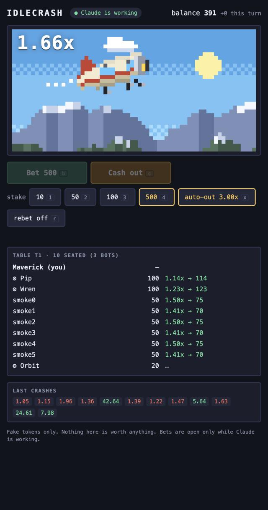

# IdleCrash

Bet fake tokens in a Crash game with other people who are also waiting for Claude.

You send Claude a task. A pixel-art 1960s prop plane takes off. Everyone at your table bets before
take-off and cashes out before the plane crashes. When Claude finishes, betting locks and you are
back to work.



- **No real money.** Tokens are fake. They cannot be bought, sold or withdrawn.
- **Only while Claude works.** Betting is open while any of your Claude Code sessions is working and
  locks when the last one stops. An open bet is cashed out for you at that moment.
- **5 to 10 people per table.** Rounds run on the server's clock, so nobody waits for anybody. Bots may
  fill up to 30% of a table and are marked with a gear (⚙).
- **Terminal or desktop app.** In a terminal the game is a pane next to the chat. In the desktop app and
  in editors it opens in your browser.


## Install

You need Claude Code 2.1.291 or newer. Mods are early access, so the API can change between releases
and a newer build may need an update of this mod.

```bash
claude plugin marketplace add grozoww/idlecrash
claude plugin install idlecrash@grozoww-mods
```

Restart Claude Code and send it any task. The game opens by itself the first time Claude starts working.
Type `/idlecrash` to open it yourself at any time.

To remove it: `claude plugin uninstall idlecrash`.

## Play

In a terminal the game is a pane. It needs a window at least 144 columns wide; in a narrower one the game
opens in your browser instead. Click the pane, or press `ctrl+x` and then `tab`, to give it the keyboard.
In the browser, click the page first. Then:

| Key | Does |
| --- | --- |
| `b` | Bet your stake in the betting phase |
| `c` | Cash out while the plane flies |
| `1` `2` `3` `4` | Stake: 10, 50, 100, 500 |
| `x` | Cycle the auto cash-out: off, 1.5x, 2x, 3x, 5x, 10x |
| `r` | Bet again every round |
| `space` | Bet or cash out, whichever fits (browser) |

Auto cash-out is paid by the server at exactly that number, so you can leave the game alone. You start
with 1000 tokens. If you go broke you get 200 back, at most once every 10 minutes. The payout is the stake
times the multiplier, rounded down: 50 cashed out at 2.00x pays 100, a profit of 50.

Commands in Claude Code:

- `/idlecrash` opens the game: the pane in a terminal, the browser elsewhere
- `/idlecrash web` opens it in the browser. `/idlecrash link` prints the address instead
- `/idlecrash off` and `/idlecrash on`: open the game by itself when Claude starts working, or not
- `/idlecrash name <nickname>` changes your nickname
- `/idlecrash top` shows the richest players

## The server

The mod plays on a server run by the author, at `https://178-105-28-170.sslip.io`. It is a small machine
and has no promise of uptime. When it is down the mod does nothing and says so on the status line. The
address is the `serverUrl` setting:

```bash
claude plugin install idlecrash@grozoww-mods --config serverUrl=https://your-server.example
```

or later in `/config`. You can run your own: see [Run a server](#run-a-server).

## What the server sees

- Your nickname, a random anonymous id and secret (made on first use, kept in the plugin's store on your
  machine), your bets and cash-outs.
- Which of your Claude Code sessions are working, as a yes or no with a random session id. Never what
  they work on.
- Your IP address, like any web server. It is used for rate limiting in memory and not written to disk.

It never sees your prompts, your code, your files or anything else about your session. The mod only talks
to the one address in `serverUrl`. The browser page gets a key of its own through a one-time link, so
your plugin's secret never reaches the browser; the page keeps that key and your picks (stake, auto
cash-out) in the browser's local storage. Nicknames show to everyone at your table and on the top list:
keep them friendly.

## Run a server

The server is one Bun process with no database. Accounts live in a JSON file. It also serves the game page.

```bash
cd server
bun src/server.ts        # the game page and the API on http://localhost:8787
```

| Env | Default | |
| --- | --- | --- |
| `PORT` | `8787` | |
| `HOST` | `0.0.0.0` | Use `127.0.0.1` behind a reverse proxy |
| `DATA_DIR` | `./data` | Where `accounts.json` is kept |
| `BOT_PCT` | `30` | Bots are at most this percent of a table |
| `TRUST_PROXY` | unset | Set to `1` behind a proxy so limits use `X-Forwarded-For` |
| `MAX_SOCKETS_PER_IP` | `10` | Open game pages per address |
| `ACCOUNTS_PER_IP_HOUR` | `10` | New accounts per address per hour |

Put it behind HTTPS before sharing it. The mod sends a secret in a header, so plain `http://` is only fine
for `localhost`. [`deploy/`](deploy/README.md) has a cloud-init file, a systemd unit, a Caddyfile and a
one-command deploy for a small Ubuntu machine.

Point your mod at it with `serverUrl` (for a local one, `http://localhost:8787`).

To try it alone with a lively table, start six fake players for 50 seconds:

```bash
bun server/scripts/smoke.ts http://localhost:8787 6
```

To work on the page without Claude Code, `bun server/scripts/fake-mod.ts` makes an account, says "Claude
is working" every 2 seconds and prints the address that opens the page.

## How it works

- Each round has a betting phase (8 s), a flight and a crash. The server picks the crash point after
  betting closes: the chance of reaching `x` is 0.99 / `x`, so the house edge is 1%. It never sends the
  crash point before the crash.
- The page talks to the server over a WebSocket. The server pushes the table when it changes, and the page
  draws the plane itself from the server's clock, 30 times a second. The server, not your screen, decides
  whether a cash-out came in time.
- The mod tells the server every 2 seconds that a session is working, and opens the game. If the beats
  stop (Claude Code closed or crashed), the table locks by itself. In a terminal the pane polls the server
  and draws the picture with a `Client`, which has its own frame clock, so the buttons are not redrawn
  while the plane moves.
- A player is whoever holds the account secret; there is no login. Lose the plugin's store and you start
  again with a new account.

## Develop

```bash
bun test ./server ./shared       # engine, scene, end-to-end tests (they start a server on a spare port)
cd mod && claude plugin validate . && claude plugin test .
bun tools/preview-scene.ts       # draws the pixel art to /tmp/idlecrash-scene.png
bun tools/sync-shared.ts         # after editing shared/: copies it into the mod
claude --plugin-dir "$PWD/mod"   # load the mod from this checkout
```

`shared/` holds the scene and helpers used by the page and the mod. A plugin installed from a marketplace
gets only its own folder, so `mod/hooks/shared/` is a generated copy; `bun test` fails when it is stale.

## License

MIT, see [LICENSE](LICENSE).
